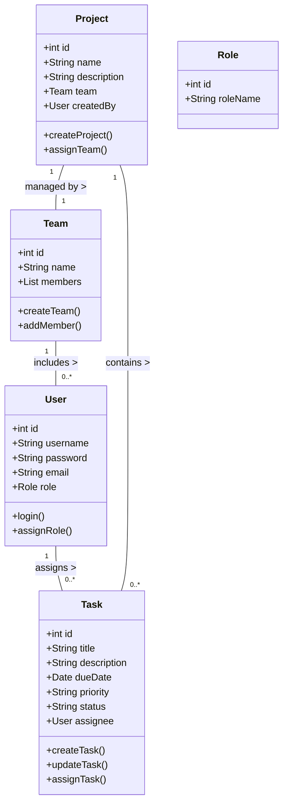
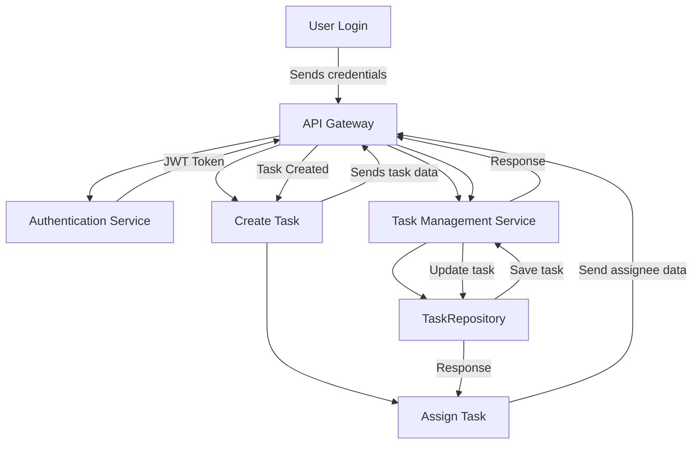

# TASK MANAGEMENT APP - Microservice Architecture

## High-Level Design (HLD) for Task Management System

### 1. **Architecture Overview**
The system is designed using a **microservice architecture** where each service is independently deployable and can communicate with others via RESTful APIs. The frontend (React/Angular) interacts with the backend services through an API Gateway. **Spring Security** manages user authentication and authorization with **JWT tokens**. The system utilizes **Zipkin** for distributed tracing and **Resilience4j** for circuit breaking and fault tolerance.

### 2. **Main Components**
- **Frontend (React/Angular)**: 
  - Handles the user interface, task creation, assignment, and interaction with the API Gateway.
- **API Gateway**: 
  - Acts as a single entry point for all client requests and routes them to the appropriate backend services.
- **Backend Microservices**:
  - **Task Management Service**: Manages task operations, including creation, updating, and retrieval.
  - **Project Management Service**: Manages project data and associations with tasks and users.
  - **Team Management Service**: Admins can create teams and assign roles.
  - **Authentication Service**: Manages user authentication using **JWT**.
  - **Authorization Service**: Handles role-based access control using **Spring Security**.
- **Database (MySQL/PostgreSQL)**: Each microservice can have its own database schema or shared databases depending on the use case.
- **Zipkin**: For distributed tracing of requests across microservices.
- **Resilience4j**: To implement circuit breakers, rate limiting, and retries in microservices.
- **Security Layer (Spring Security)**: Protects endpoints using JWT and role-based access.

### 3. **Key Features**
- **Microservices**: Each functionality is encapsulated in its microservice.
- **Task Management**: Users can create, update, and assign tasks with due dates and priority levels.
- **Role-Based Access Control**: Different permissions for Admins, Team Leads, and Users.
- **JWT-based Authentication**: Secure login and session management using JWT.
- **Distributed Tracing**: Track requests across services using Zipkin.
- **Fault Tolerance**: Manage service failures and retries with Resilience4j.

---

## Low-Level Design (LLD) for Task Management System

### 1. **Database Design**

**Tables**:
1. **Users Table**: 
   - `id`, `username`, `password`, `email`, `role`
2. **Tasks Table**: 
   - `id`, `title`, `description`, `due_date`, `priority`, `status`, `project_id`, `assignee_id`, `created_by`
3. **Projects Table**: 
   - `id`, `name`, `description`, `team_id`, `created_by`
4. **Teams Table**: 
   - `id`, `name`, `description`, `created_by`
5. **Roles Table**: 
   - `id`, `role_name` (Admin, Team Lead, User)

**Relationships**:
- **One-to-Many**: A project can have multiple tasks.
- **Many-to-Many**: Users can be assigned to multiple projects via teams.
- **Many-to-One**: A task can have a single assignee, but users can have multiple tasks.

### 2. **Class Diagram**

### 3. **Sequence Diagram**: Task Assignment Flow

1. **User Login**
   - User enters login credentials.
   - Frontend sends credentials to the Authentication Service via the API Gateway.
   - Authentication Service verifies credentials and returns a JWT token.

2. **Create Task**
   - User (team lead) creates a task using the UI.
   - Frontend sends task data and JWT token to the Task Management Service via the API Gateway.
   - Task Management Service verifies user’s role using the JWT and creates the task in the database.

3. **Assign Task**
   - Team lead selects a user to assign the task.
   - Frontend sends assignee details to the Task Management Service via the API Gateway.
   - Task Management Service updates the task in the database.

4. **Update Task Status**
   - User views assigned tasks.
   - Frontend retrieves tasks by sending a request to the Task Management Service via the API Gateway with JWT.
   - Task Management Service returns tasks assigned to the user.
   - User updates task status.
   - Frontend sends updated status to Task Management Service, which updates the database.

### 4. **Component Diagram**

- **Frontend**: 
  - Components: `Login`, `TaskList`, `TaskDetails`, `ProjectList`, `CreateTask`
  - API calls: 
    - `/api/auth/login` (API Gateway)
    - `/api/tasks` (API Gateway)
    - `/api/projects` (API Gateway)
    
- **Microservices**: 
  - **Task Management Service**: `TaskController`, `TaskService`, `TaskRepository`
  - **Project Management Service**: `ProjectController`, `ProjectService`, `ProjectRepository`
  - **Authentication Service**: `AuthController`, `UserService`, `UserRepository`
  - **Team Management Service**: `TeamController`, `TeamService`, `TeamRepository`
  - **Authorization Service**: `AuthController`, `RoleService`, `RoleRepository`

### 5. **Flow Diagram**: Task Creation and Assignment

### 6. **Zipkin Integration**
- Each microservice is configured to send tracing information to Zipkin.
- Zipkin collects traces for requests flowing through the API Gateway to the respective services.

### 7. **Resilience4j Integration**
- **Circuit Breaker**: Implemented in each microservice to handle failures gracefully.
- **Rate Limiter**: Controls the number of requests that can be made to each service.
- **Retry**: Automatically retries requests that fail due to transient errors.

---

### Diagram Summary:

1. **Architecture Diagram**: Overall architecture, including frontend, API Gateway, microservices, Zipkin, and Resilience4j.
2. **Class Diagram**: Represents core classes like `User`, `Task`, `Project`, `Team`, `Role`, and their relationships.
3. **Sequence Diagram**: Shows how a task is created and assigned in the system.
4. **Flow Diagram**: Illustrates the flow of task creation and assignment.

This microservice architecture enhances the Task Management System's scalability, maintainability, and resilience using **Spring Boot**, **Spring Security**, **JWT**, **Zipkin**, and **Resilience4j**, with a frontend in **React** or **Angular**.

### Microservice Architecture Diagram

                                +-------------------+
                                |     Frontend      |
                                |  (React/Angular)  |
                                +-------------------+
                                          |
                                          |
                                          v
                                +-------------------+
                                |     API Gateway   |
                                +-------------------+
                                          |
                                          |
              +---------------------------+-----------------------------+
              |                           |                             |
              v                           v                             v
      +-------------------+     +--------------------+       +-------------------+
      | Task Management   |     | Project Management |       | Authentication    |
      |     Service       |     |      Service       |       |      Service      |
      +-------------------+     +--------------------+       +-------------------+
                |                          |                            |
                |                          |                            |
                |                          |                            |
                v                          v                            v
      +-------------------+      +-------------------+        +------------------+
      |  Task Repository  |      | Project Repository|        | User Repository  |
      +-------------------+      +-------------------+        +------------------+
                |                          |                            |
                |                          |                            |
                v                          v                            v
        +--------------+            +-------------+              +--------------+
        |  MySQL       |            |  MySQL      |              |    MySQL     |
        | /PostgreSQL  |            | /PostgreSQL |              | /PostgreSQL  |
        +--------------+            +-------------+              +--------------+

### Summary of Diagram Components
1. **Frontend**: The user interface built using React or Angular.
2. **API Gateway**: The entry point for all client requests, routing them to the appropriate microservices.
3. **Microservices**:
    - **Task Management Service**: Handles all task-related operations.
    - **Project Management Service**: Manages project-related data.
    - **Authentication Service**: Manages user authentication.
4. **Repositories**: Each microservice interacts with its own database to store and retrieve data.
5. **Zipkin**: Collects and manages tracing information for distributed systems.
6. **Resilience4j**: Implements fault tolerance, such as circuit breaking and rate limiting.
 
You can format this in any markdown viewer or text editor to create a visual representation of the microservice architecture for your project. Let me know if you need any modifications or additional details!

### Database Schema Diagram

         +----------------+         +------------------+       +----------------+
         |    Users       |         |    Tasks         |       |   Projects     |
         +----------------+         +------------------+       +----------------+
         | id (PK)        |         | id (PK)          |       | id (PK)        |
         | username       |         | title            |       | name           |
         | password       |         | description      |       | description    |
         | email          |         | due_date         |       | team_id (FK)   |
         | role           |         | priority         |       | created_by     |
         | created_at     |         | status           |       | created_at     |
         | updated_at     |         | project_id (FK)  |       | updated_at     |
         |                |         | assignee_id (FK) |       |                |
         |                |         | created_by       |       |                |
         |                |         | created_at       |       |                |
         |                |         | updated_at       |       |                |
         +----------------+         +------------------+       +----------------+
                 |                          |                            |
                 |                          |                            |
                 +--------------------------+                            |
                 |                                           +----------------+
                 |                                           |     Teams      |
                 |                                           +----------------+
                 |                                           | id (PK)        |
                 +-----------------------------------------> | name           |
                                                             | description    |
                                                             | created_by     |
                                                             | created_at     |
                                                             | updated_at     |
                                                             +----------------+

### Explanation of the Schema

1. **Users Table**:

    - **id**: Unique identifier for each user (Primary Key).
    - **username**: User's login name.
    - **password**: User's password (hashed).
    - **email**: User's email address.
    - **role**: User's role (Admin, Team Lead, User).
    - **created_at**: Timestamp of when the user was created.
    - **updated_at**: Timestamp of when the user was last updated.

2. **Tasks Table**:

    - **id**: Unique identifier for each task (Primary Key).
    - **title**: Title of the task.
    - **description**: Description of the task.
    - **due_date**: Due date for task completion.
    - **priority**: Priority level of the task.
    - **status**: Current status of the task (e.g., In Progress, Completed).
    - **project_id**: Foreign Key referencing the Projects table.
    - **assignee_id**: Foreign Key referencing the Users table (who is assigned the task).
    - **created_by**: User who created the task (Foreign Key).
    - **created_at**: Timestamp of when the task was created.
    - **updated_at**: Timestamp of when the task was last updated.

3. **Projects Table**:

    - **id**: Unique identifier for each project (Primary Key).
    - **name**: Name of the project.
    - **description**: Description of the project.
    - **team_id**: Foreign Key referencing the Teams table.
    - **created_by**: User who created the project (Foreign Key).
    - **created_at**: Timestamp of when the project was created.
    - **updated_at**: Timestamp of when the project was last updated.

4. **Teams Table**:

    - **id**: Unique identifier for each team (Primary Key).
    - **name**: Name of the team.
    - **description**: Description of the team.
    - **created_by**: User who created the team (Foreign Key).
    - **created_at**: Timestamp of when the team was created.
    - **updated_at**: Timestamp of when the team was last updated.

 
You can adjust this schema based on any specific requirements or additional functionalities you want to implement in your Task Management System!